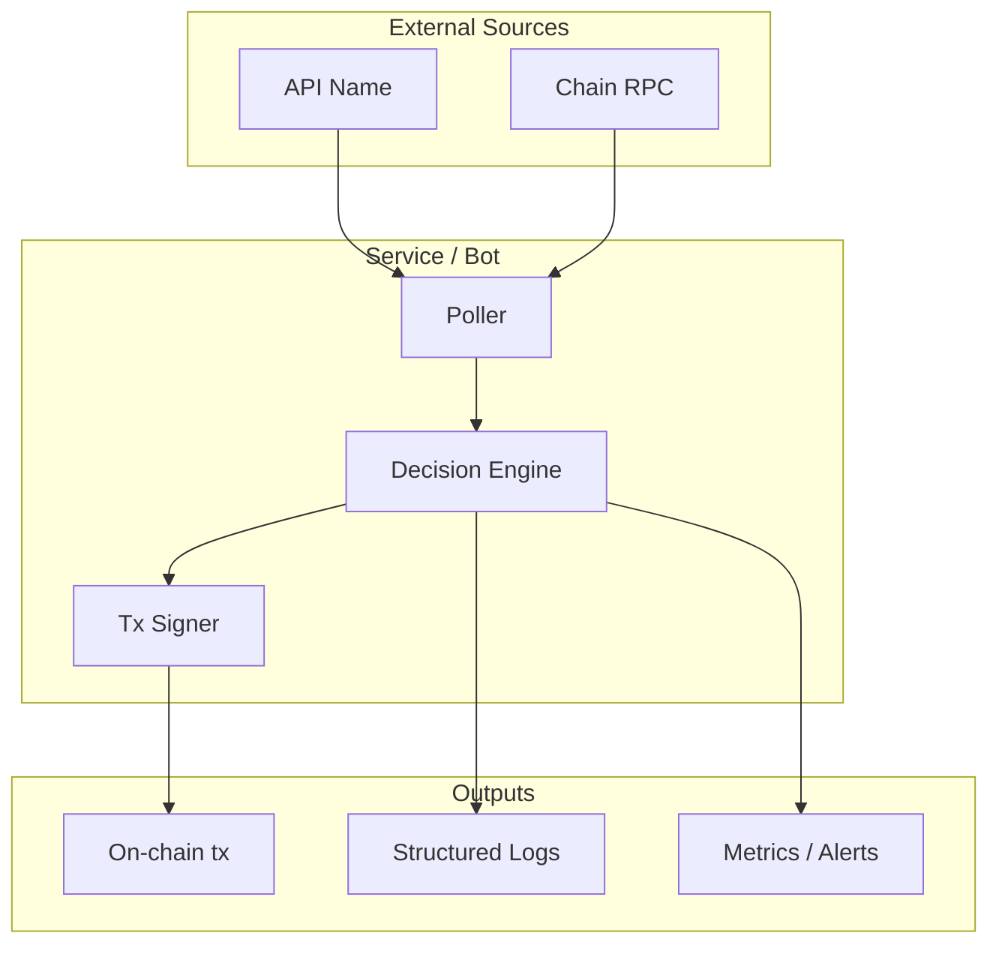
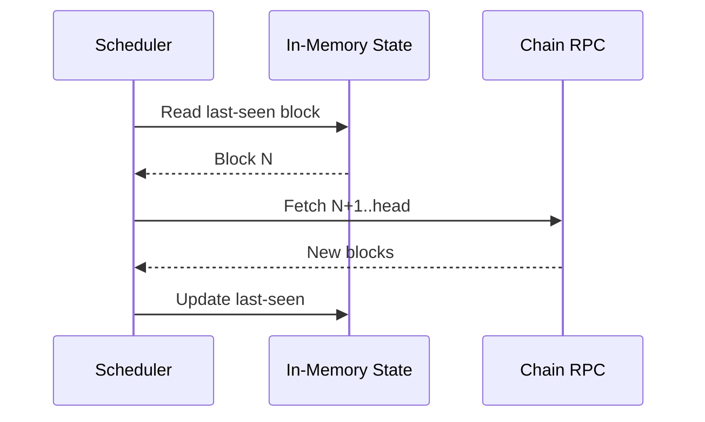
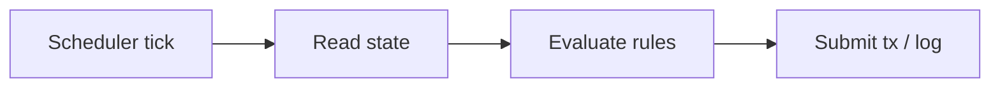

# Data Flow: {Bot or Package Name}

> Last verified: YYYY-MM-DD

## Overview

<!-- Brief prose summary of where data originates, how it moves through the service,
     and any notable patterns (polling vs. event-driven, batched vs. per-tick, etc.). -->

## External Data Sources

| Source                 | Type                      | Endpoint / Config | Auth                         |
| ---------------------- | ------------------------- | ----------------- | ---------------------------- |
| <!-- e.g. MorphoApi --> | GraphQL / REST / RPC      | `ENV_VAR` or URL  | <!-- API key, none, etc. --> |
| <!-- e.g. chain RPC -->| JSON-RPC                  | `PRIVATE_RPC_URL` | <!-- signer / none -->       |

## Architecture Diagram

<!--
  High-level Mermaid flowchart showing how data moves from external sources
  through the service's internal modules to its outputs (transactions, logs, metrics, etc.).
  Use subgraphs to group related modules.
-->

## Fetching Mechanisms

| Mechanism                    | Library          | Used For                    | Config                              |
| ---------------------------- | ---------------- | --------------------------- | ----------------------------------- |
| <!-- e.g. viem client -->    | `viem`           | On-chain reads / writes     | <!-- transport, chain config -->    |
| <!-- e.g. fetch w/ retry --> | `@repo/utils`    | REST / GraphQL calls        | <!-- retry budget, timeout -->      |

## Caching / State Strategy

<!--
  Mermaid sequence diagram showing how a typical tick flows through any cache,
  in-memory state, or persistence layer before hitting external sources.
-->

| Layer                              | Technology      | TTL / Eviction              | Scope   |
| ---------------------------------- | --------------- | --------------------------- | ------- |
| <!-- e.g. in-memory LRU -->        | plain `Map`     | <!-- size-bounded -->       | Process |

## Data Flow by Workflow

<!--
  Include Mermaid flowcharts for 1–2 representative workflows (e.g., "reallocate vault",
  "liquidate position") that best illustrate the bot's decision logic. Summarise remaining
  workflows in prose — agents can discover per-workflow detail by reading the code.
-->

### Workflow Name (`module/path`)

Other workflows follow similar patterns — briefly describe the shared pattern here.
